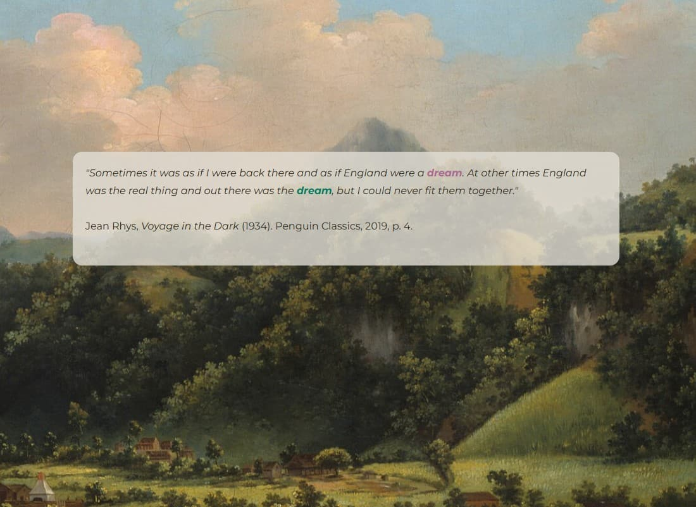

---
title: "Explore the Project"
permalink: /project/
page_css:
  - /assets/css/styles.css
--- 

    

    <a href="https://meredithsauer.github.io/caribbean-collages/project-view.html" target="_blank" class="btn" id="twine-btn">Open in New Tab</a>

